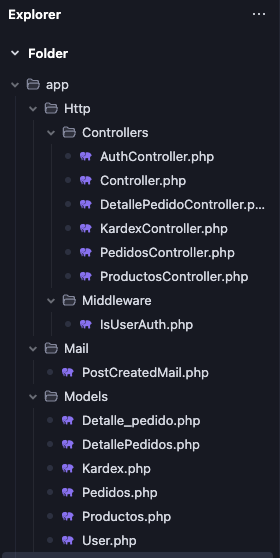

# Inventario Inteligente Backend
Este proyecto es el backend del inventario inteligente, el cual es una aplicación movil que permite gestionar inventarios de manera inteligente.

## Archivos importante

- **.env**: Archivo de configuración de variables de entorno.
- Carpeta de **MODELO** app/Models
- Carpeta de **CONTROLADOR** app/Http/Controllers
- Carpeta de **RUTAS** routes/api.php
- Carpeta de **MIGRACIONES** database/migrations
- Archivo **config/jwt.php**
## Requisitos
- PHP >= 8.0
- Composer
- MySQL
## Instalación
1. Clona el repositorio:
```bash
git clone https://github.com/Mario-Tubay/back-apptlink.git
```
2. Instala las dependencias:
```bash
composer install
```
3. Crea el archivo de configuración de variables de entorno:
```bash
 .env
```
4. Ejecuta las migraciones:
```bash
php artisan migrate
```
## Correo
Se uso el correo de gmail para el envio de correos. el archivo de plantilla de envio de correos se encuentra en **resources/views/emails/forgot-password.blade.php**


### Archivos importantes
